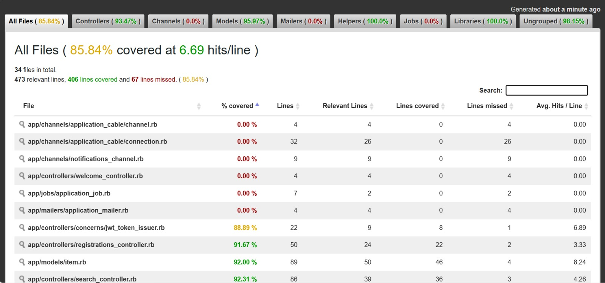

# CUHK Second-hand Marketplace SaaS

## Project Overview

CUHK Second-hand Marketplace SaaS is a centralized trading platform for CUHK students to buy and sell second-hand items such as textbooks, furniture, and daily necessities. The system is designed as a SaaS-style marketplace where hostels and colleges act as separate communities with their own listing rules and permissions.

- **Deployed application:** https://calm-woodland-37162-a0850eb97b8f.herokuapp.com/
- **GitHub repository:** https://github.com/LinChiPang/CSCI3100-Group2-Project
- **Course:** CSCI3100 Software Engineering, Spring 2026
- **Topic:** CUHK Second-hand Marketplace SaaS

## Pain Points

- Students currently rely on fragmented channels such as WhatsApp groups, Telegram groups, and Instagram pages.
- Existing channels do not provide structured item tracking, so it is hard to know whether an item is available, reserved, or sold.
- Search is limited, making it difficult to filter by college, price, or item type.
- Each community may have different listing rules, such as allowed categories, price caps, or posting limits.
- There is limited accountability because many existing channels do not verify CUHK community identity.

## Solution Summary

The platform provides a unified marketplace with community-based segmentation for different CUHK hostels and colleges. Users can authenticate through CUHK email verification, browse and search listings, track item status, and follow community-specific rules configured by administrators.

Core marketplace status workflow:

```text
Available -> Reserved -> Sold
```

## Tech Stack

| Area | Technology |
|---|---|
| Frontend | React.js, Tailwind CSS |
| Backend | Ruby on Rails API |
| Database | PostgreSQL |
| Hosting | Heroku |
| Version Control | GitHub |
| Authentication | Devise or OmniAuth-style CUHK email verification |
| Testing | RSpec, Cucumber, SimpleCov |

## Implemented Features

### Core Features

- Community-based marketplace for CUHK colleges.
- Listing search and filtering by category, price, and community tags.
- Item status management from available to reserved to sold.
- CUHK email-based user authentication.
- Admin-configurable community rules and permissions.
- SaaS-style data organization for per-community customization.

### Advanced Features

- **Mock payment:** Stripe-style payment flow for marketplace transactions.
- **Real-time notifications:** ActionCable WebSocket support for chat or notifications.
- **Fuzzy search:** Intelligent search suggestions and auto-complete behavior.
- **Analytics dashboard:** Admin dashboard for transaction and listing statistics.

## Local Setup Guide

### Prerequisites

- Ruby and Bundler
- PostgreSQL
- Node.js and npm

### Install Backend Dependencies

```bash
bundle install
```

### Install Frontend Dependencies

```bash
cd frontend
npm ci
cd ..
```

### Database Setup

```bash
bin/rails db:create
bin/rails db:migrate
bin/rails db:seed
```

If your local PostgreSQL setup requires explicit credentials, configure these environment variables before running Rails commands:

```bash
export DB_HOST=localhost
export DB_PORT=5432
export DB_USERNAME=postgres
export DB_PASSWORD=your_password
```

### Build Frontend

Rebuild the frontend before starting Rails whenever files under `frontend/` change.

```bash
cd frontend
npm run build
cd ..
```

### Start Development Server

```bash
bundle exec rails server
```

Then open:

- `http://localhost:3000/`
- `http://localhost:3000/payments`
- `http://localhost:3000/admin/analytics`
- `http://localhost:3000/search`
- `http://localhost:3000/notifications`

## Running Tests

Prepare the test database and run the required test suites:

```bash
bin/rails db:test:prepare
bundle exec rspec
bundle exec cucumber
```

## Demo Video

A 5-minute video demonstrating:
- Register or log in with CUHK email.
- Create a marketplace listing.
- Search and filter listings.
- Reserve an item as a different user.
- Show fuzzy search suggestions.
- Show mock payment and analytics pages.

## SimpleCov Report


85.84% coverage

## Feature Ownership

| Feature Name | Primary Developer | Secondary Developer | Notes |
|---|---|---|---|
| User Auth & Roles | Louis | Eric | CUHK email verification, Devise or OmniAuth-style authentication, policy checks |
| Marketplace Listings | Louis | Eric | CRUD, search/filtering, and item status workflow |
| Community Rules | Patrick | Louis, Eric | Per-community listing rules and permissions |
| Frontend | Eric | Patrick | Frontend design, React |
| Fuzzy Search | Jason | Eric | Search suggestions and auto-complete |
| Real-time Notifications | Jason | Eric | ActionCable WebSocket support |
| Mock Payment | Jason | Eric | Stripe-style mock payment flow |
| Analytics Dashboard | Jason | Louis, Eric | Admin transaction and listing statistics |
| Deployment | Patrick |  | Deploy and configure App on Heroku |
